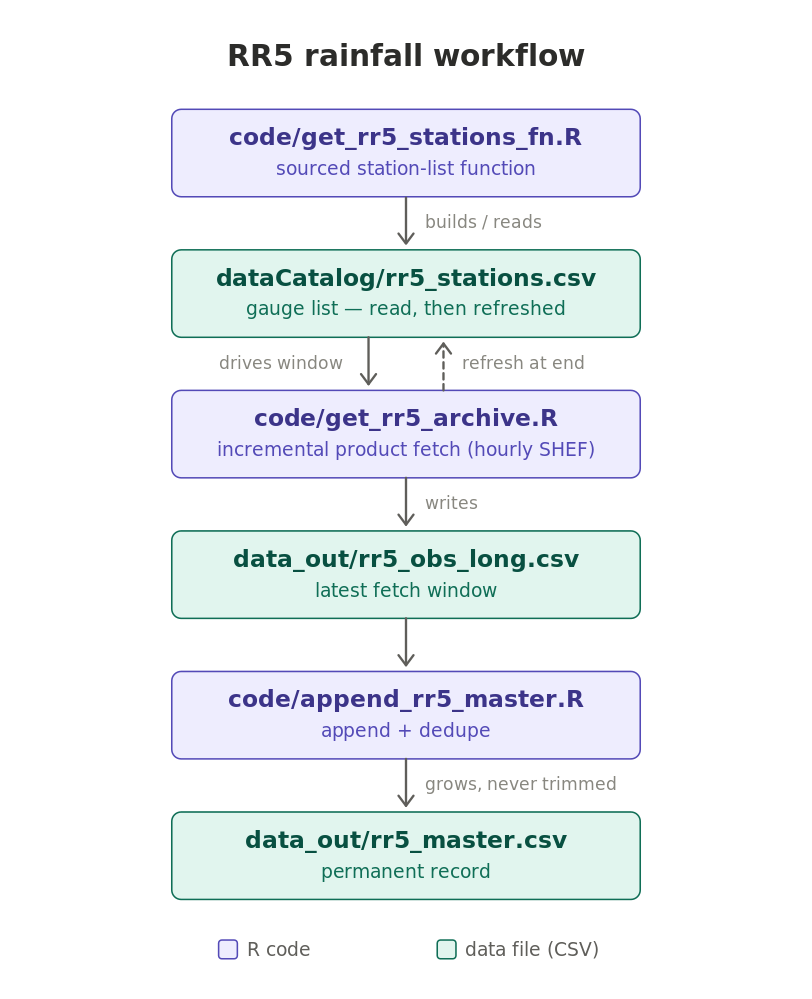

# RR5 rainfall workflow

Hourly, catalog-driven collection of 1-hour rainfall totals for ~200
automated rain gauges across the State of Hawaii, parsed from the National
Weather Service Honolulu office's **RR5HFO product** (Hawaii One-Hour
Rainfall Summary, SHEF format). The gauge network spans county hydronet,
RAWS, USGS, UH-Mānoa mesonet, HSOIS, and NOAA/USFWS stations plus the ASOS
airports — most of these gauges' rainfall is **not available through the
NWS observations API**, making this product the only public real-time
source for them. Each run fetches only the product-hours that are missing
and folds them into a permanent, deduplicated master table.



## How it works

The pipeline is driven by a **station list** (`dataCatalog/rr5_stations.csv`)
parsed from the newest product, carrying each gauge's location, source
network, island, and two freshness timestamps:

| Column | Meaning |
|---|---|
| `latest_obs_api` | the newest product's obs-ending hour, if the gauge reported a real value in it (NA = reported "M") |
| `latest_obs_data` | newest non-missing value per gauge already collected into our data |

Each run:

1. **Load the station list** — `get_rr5_stations()` (from
   `code/get_rr5_stations_fn.R`, sourced) reads the cached list, or builds
   and writes it on the first run. The `dataCatalog/` folder is created at
   the project root automatically.
2. **Size the fetch window** — every RR5 product carries ALL gauges, so the
   incremental unit is hours of products rather than per-station windows:
   the script fetches from the oldest `latest_obs_data` across gauges to
   now, with a 12-hour minimum and the API's ~7-day product retention as
   the cap. Because `latest_obs_data` tracks the newest *non-missing*
   value, a gauge that has been transmitting "M" for a while pulls the
   window back — runs deliberately over-fetch rather than risk a gap, and
   re-fetched hours cost nothing but a request (the append dedupes them).
   A manual override is available
   (`Rscript code/get_rr5_archive.R 73` = newest 73 products).
3. **Fetch and parse** — each hourly product's SHEF text is parsed: the
   obs-ending hour comes from the `.B` header (HST), gauge lines yield
   station, value, and unit. Coding: `M` (missing) → NA; `T` (trace) →
   0.001 in. If an hour was reissued/corrected, the newest issuance wins.
4. **Write the snapshot** — `data_out/rr5_obs_long.csv`, long format:
   `station_id | datetime | variable | value | unit`
   (single variable `precip_1hr`, inches, UTC datetimes).
5. **Refresh the station list** — the run ends by re-parsing the newest
   product and re-deriving both freshness columns, so the next run knows
   exactly what is missing.
6. **Append to the master** — `code/append_rr5_master.R` folds the snapshot
   into `data_out/rr5_master.csv`, deduplicating on
   `station_id + datetime + variable` (incoming rows win, so corrections
   replace stale values). The master is the permanent record and the only
   file that needs backing up.

Catch-up after downtime is automatic: the window stretches to match
whatever gap the station list reveals, up to the ~7-day retention — so
runs must happen at least weekly to avoid gaps in the master.

## Files

All R code lives in `code/`; data directories sit beside it at the project
root, so the scripts run correctly from any working directory.

```
<project root>/          <- data_out/ and dataCatalog/ are created here
`-- code/                <- all four .R files live here, together
```

Each script resolves its own location and takes the **parent** as the data
root, so this nesting matters: put the code at the project root instead and
the data directories would land one level above it.

| File | Role |
|---|---|
| `code/get_rr5_stations_fn.R` | cache-aware station-list function (sourced; also runs standalone) |
| `code/get_rr5_archive.R` | the fetcher — steps 1–5 above |
| `code/append_rr5_master.R` | snapshot → master accumulator |
| `code/install_deps.R` | one-time CRAN dependency installer |
| `cron_rr5.txt` | ready-to-install hourly crontab entry |
| `dataCatalog/rr5_stations.csv` | gauge list with freshness timestamps |
| `data_out/rr5_obs_long.csv` | latest fetch window (overwritten each run) |
| `data_out/rr5_master.csv` | permanent deduplicated record |
| `runlogs/` | cron stdout/stderr logs (gitignored) |

## Usage

```bash
Rscript code/get_rr5_archive.R      # fetch (catalog-driven window)
Rscript code/append_rr5_master.R    # fold into the master
```

Run both, in that order, on a schedule (hourly works well; the product is
issued once per hour). Because the scripts anchor their own paths, cron can
call them by absolute path with no `cd`. Chain them so a failed fetch does
not re-fold a stale snapshot:

```bash
Rscript /path/to/code/get_rr5_archive.R && \
  Rscript /path/to/code/append_rr5_master.R
```

A full run is quick — one listing request plus one request per product
hour, about 20 s for a 60-product window.

### Scheduling

`cron_rr5.txt` holds the ready-to-install crontab entry — copy its second
line into `crontab -e`:

```
45 * * * * /bin/sh -c '<abs>/code/get_rr5_archive.R && <abs>/code/append_rr5_master.R' \
             >> <abs>/runlogs/nwsrr5_hrly.out 2>> <abs>/runlogs/nwsrr5_hrly.err
```

**:45 past the hour** because the RR5HFO product is issued between :30 and
:35 past (measured across a full 7-day retention window; never later than
:35), and the product issued at `HH:30` carries the hour *ending* at
`HH:00` — so :45 collects the freshest hour that exists with a 10-minute
cushion. Running earlier loses no data, since windows overlap and the
append dedupes, but adds an hour of latency. This host is
`Pacific/Honolulu` (UTC−10, no DST), so minute-past-the-hour is the same in
HST and UTC and the schedule needs no seasonal adjustment.

The `/bin/sh -c '...'` wrapper is required, not cosmetic: written bare, the
redirects would attach only to the second command and the fetcher's output
would go to cron's mail instead of the log.

Output lands in `runlogs/` (gitignored, created on demand):

| File | Holds |
|---|---|
| `runlogs/nwsrr5_hrly.out` | the full run transcript — every progress line |
| `runlogs/nwsrr5_hrly.err` | **only** warnings and errors; empty after a clean run |

That split is why the scripts report progress with `say()` (a thin `cat()`
wrapper) rather than `message()`, and wrap `library()` in
`suppressPackageStartupMessages()` — both of those write to stderr in R,
which would otherwise fill `.err` with routine chatter on every run. Note
the logs append, so they grow without bound; rotate or truncate them if
that matters.

The companion NWS API workflow is scheduled at **:07** so the two never
overlap.

### What a run needs locally

The fetcher needs exactly **one** other local file.

| Needed | Why |
|---|---|
| `code/get_rr5_stations_fn.R` | sourced by the fetcher; must sit in the same directory. Missing it is fatal at startup. |
| R ≥ 4.1 plus `httr2`, `dplyr`, `purrr`, `tibble`, `readr` | run `Rscript code/install_deps.R` once. |
| network access to `api.weather.gov` | no API key — the API only requires a `User-Agent` header, set in the scripts |

Everything else is optional, and is created or rebuilt automatically:

- `dataCatalog/rr5_stations.csv` — built from the newest product if
  missing. Having it just tells the run how far behind it is.
- `data_out/rr5_obs_long.csv` — an output, not an input. It is read only at
  the end of a run, to derive `latest_obs_data`; if absent you get a
  warning and `NA` timestamps, nothing worse.
- `data_out/` and `dataCatalog/` — created on demand.

So a minimal deployment is **two `.R` files plus the packages**
(`get_rr5_archive.R` and `get_rr5_stations_fn.R`), or all four if you also
want the master accumulator and the dependency installer.

### Station-list staleness

Unlike the companion NWS API workflow, a stale station list cannot wedge
this pipeline, so no age check is needed. The list only *sizes* the fetch
window: an out-of-date `latest_obs_data` makes the window longer, and it is
clamped to the ~7-day retention either way. Gauge coverage does not depend
on it — every product carries all gauges, and every gauge line is parsed
regardless of what the list contains, so a gauge added to the product shows
up in the data on its first run and in the list at the end of that same
run. A missing list is simply rebuilt.

The one thing a stale list costs is metadata freshness (island, source
network, `latest_obs_api`), and the end-of-run refresh keeps that current
in normal hourly operation.

## Data notes

- Products come from
  `https://api.weather.gov/products/types/RR5/locations/HFO` — the same
  text shown on https://www.weather.gov/hfo/RR5_archive, but as JSON and
  with ~7 days of retention instead of 72 hours.
- The product is provisional, non-quality-controlled gauge data.
- ~190 of the ~200 listed gauges actively report; the rest transmit "M".
- Datetimes in both output files are UTC text (`YYYY-MM-DD HH:MM:SS`). Note
  that the companion NWS API workflow writes HST text instead — the two
  masters are not directly joinable on `datetime` without converting.
- For history beyond the 7-day retention, the same gauge network (minus the
  UH-Mānoa mesonet sites) is archived back to January 2011 in the Iowa
  Environmental Mesonet's `HI_DCP` feed — see `../get_iem_dcp.R`.

See the repository root `README.md` and `WORKFLOWS.md` for the companion
NWS API observations workflow (same design, per-station windows) and the
other tools in this toolkit.
